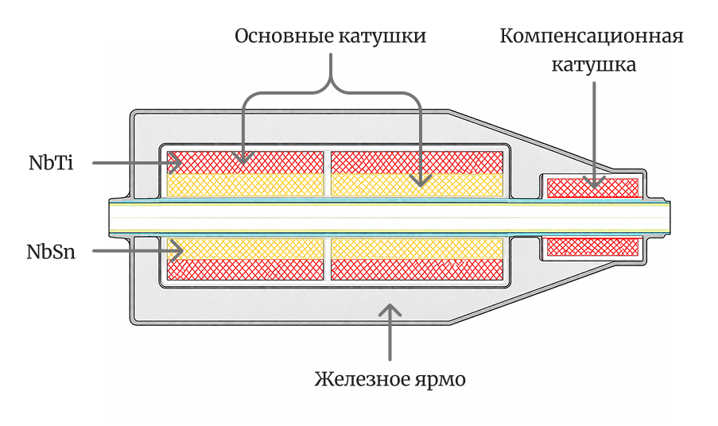
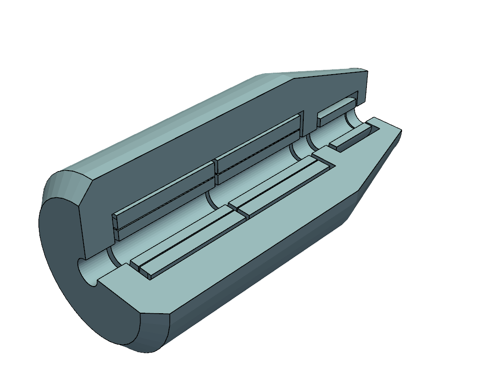
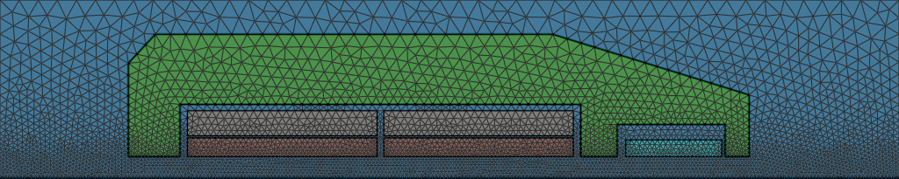
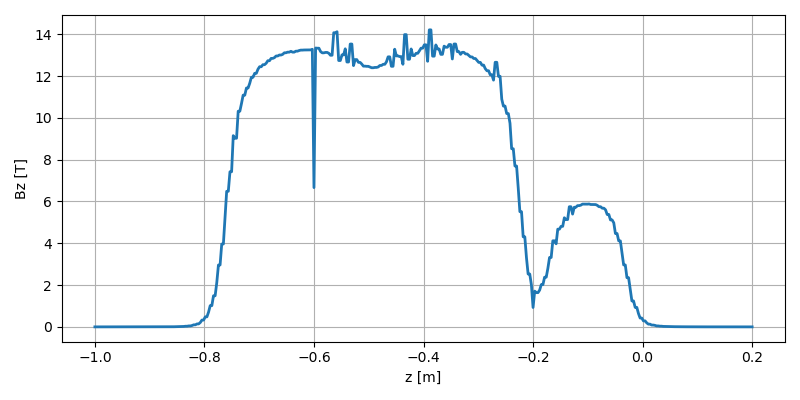

# Формулировка

Исследуется распределение величины продольного поля на оси многокатушечного соленоида.

Внутри железного ярма установлено 5 концентрических токоведущих катушек. Вся конструкция имеет аксиальную симметрию. Необходимо найти распределение продольной компоненты магнитного поля вдоль оси системы и интеграл этой компоненты.

Схематично, исследуемая область выглядит следующим образом:

<div align="center">
    
</div>

Для всей исследуемой области известны значения магнитной проницаемости материалов. Для катушек заданы количество витков и ток. Трехмерная геометрия изображена ниже.

<div align="center">
    
</div>

# Математическая постановка

Фундаментальной математической моделью, используемой для моделирования практически всех макроскопических электромагнитных явлений, является _система уравнений Максвелла_, устанавливающая связь между компонентами электрического и магнитного полей, параметрами среды (электропроводимостью, магнитной и диэлектрической проницаемостью) и сторонними источниками электромагнитного поля в форме системы векторных дифференциальных уравнений:

$$
\nabla\textbf{H} = \textbf{J}^{ext} + \sigma\textbf{E} +
    \frac{\partial(\varepsilon\textbf{E})}{\partial t},
$$

$$
\nabla\textbf{E} = \frac{\partial\textbf{B}}{\partial t},
$$

$$
\nabla\textbf{B} = 0,\ \nabla(\varepsilon\textbf{E}) = \rho.
$$

где $\textbf{H}$ -- напряженность магнитного поля, $\textbf{J}^{ext}$ -- вектор плотностей сторонних токов, $\textbf{E}$ -- напряженность электрического поля, $\sigma$ -- удельная электрическая проводимость среды, $\varepsilon$ -- диэлектрическая проницаемость среды, $\textbf{B}$ -- индукция магнитного поля (связанная с напряженностью $\textbf{H}$ соотношением $\textbf{B} = \mu\textbf{H}$, где $\mu$ -- коэффициент магнитной проницаемости).

Задачей магнитостатики называют задачу моделирования магнитного поля, создаваемого стационарным (постоянным) электрическим током с известной плотностью распределения $\textbf{J}$. Такие поля описываются системой из двух уравнений полной системы Максвелла:

$$
\nabla\textbf{H} = \textbf{J}, \\
\nabla\textbf{B} = 0.
$$

## Описание стационарных магнитных полей с использованием вектор-потенциала

Представим $\textbf{B}$ в виде ротора некоторой вектор-функции $\textbf{A}$, называемой вектор-потенциалом: $\textbf{B} = \nabla\textbf{A}$.

При таком представлении поля $\textbf{B}$ уравнение Гаусса превращается в тождество $\nabla(\nabla\textbf{A}) = 0$, и вектор-потенциал может быть найден из уравнения Ампера, в котором $\textbf{H} = \mu^{-1}\textbf{B} = \mu^{-1}\nabla\textbf{A}$:

$$
\nabla(\frac{1}{\mu}\nabla\textbf{A}) = \textbf{J}.
$$

В случае осесимметричной задачи вектор плотности тока имеет одну ненулевую компоненту $J_{\phi}$, причем и $J_{\phi}$, и магнитная проницаемость $\mu$ не зависят от координаты $\phi$: $J_{\phi} = J_{\phi}(r, z)$, $\mu = \mu(r, z)$. В этом случае магнитное поле полностью определяется только через одну компоненту $A_{\phi}$ вектор-потенциала $\textbf{A}$, удовлетворяющую двумерному уравнению

$$
-\nabla(\frac{1}{\mu}\nabla A_{\phi}) + \frac{1}{\mu}\frac{A_{\phi}}{r^2} = J_{\phi}
$$

или в цилиндрических координатах:

$$
-\frac{1}{r}\frac{\partial}{\partial r}(\frac{r}{\mu}\frac{\partial A_{\phi}}{\partial r}) -
\frac{\partial}{\partial z}(\frac{1}{\mu}\frac{\partial A_{\phi}}{\partial z}) +
\frac{A_{\phi}}{\mu r^2} = J_{\phi}.
$$

Сделаем замену переменной

$$
u(r, z) = rA_{\phi}(r, z)
$$

и преобразуем полученное уравнение:

$$
A_{\phi} = \frac{u}{r}
$$

$$
\frac{\partial A_{\phi}}{\partial r} = \frac{1}{r}\frac{\partial u}{\partial r} - \frac{u}{r^2},\
\frac{\partial A_{\phi}}{\partial z} = \frac{1}{r}\frac{\partial u}{\partial z}
$$

$$
\frac{r}{\mu}\frac{\partial A_{\phi}}{\partial r} =
    \frac{1}{\mu}(\frac{\partial u}{\partial r} - \frac{u}{r})
$$

$$
\frac{1}{\mu}\frac{\partial A_{\phi}}{\partial z} = \frac{1}{\mu r}\frac{\partial u}{\partial z}
$$

$$
\frac{A_{\phi}}{\mu r^2} = \frac{u}{\mu r^3}
$$

Подставляя полученные соотношения в исходное уравнение и упрощая его, получаем следующее эллиптическое уравнение:

$$
-\frac{\partial}{\partial r}(\frac{1}{\mu r}\frac{\partial u}{\partial r}) -
    \frac{\partial}{\partial z}(\frac{1}{\mu r}\frac{\partial u}{\partial z}) = J_{\phi}.
$$

Поле может быть найдено из следующих соотношений:

$$
B_r = -\frac{1}{r}\frac{\partial u}{\partial z},\ B_z = \frac{1}{r}\frac{\partial u}{\partial r}.
$$

## Граничные условия

Для рассматриваемой задачи целесообразно ввести следующие граничные условия:

1. Условие на оси:

$$
r = 0 \rightarrow u = 0
$$

2. Условие на удаленной границе (поле затухает):

$$
u = 0,\ A_{\phi} = 0
$$

слабая форма в таком случае будет иметь иной вид, но после замены переменной форма снова превратится в полученную выше.

# Конечноэлементная сетка

При построении конечноэлементной сетки нужно учесть ряд важных моментов:

1. Область должна быть разбита на несколько физических групп;
2. Степень детализации сетки в области оси соленоида должна быть значительно выше, чем за пределами соленоида.

Для построения сетки воспользуемся средствами открытого пакета GMSH.

<div align="center">
    
</div>

# Численное моделирование

Для решения уравнения на построенной сетке используем вычислительную платформу для решения дифференциальных уравнений в частных производных методом конечных элементов FEniCS.

## Постановка в слабой форме

Введем тестовую функцию $v \in V$, где $V = H_0^1(\Omega)$ (квадратно интегрируемые функции с квадратно интегрируемым градиентом и нулевым значением на границе Дирихле).

Умножаем исходное уравнение на $v$

$$
-\nabla(\frac{1}{\mu r}\nabla u)v = J_{\phi}v
$$

и интегрируем по области

$$
\int_{\Omega}-\nabla(\frac{1}{\mu r}\nabla u)vd\Omega = \int_{\Omega}J_{\phi}vd\Omega.
$$

Используя формулу Грина и учитывая нулевое значение тестовой функции на границе расчетной области, получаем уравнение в слабой форме:

$$
\int_{\Omega}\frac{1}{\mu r}\nabla u \nabla v d\Omega = \int_{\Omega}J_{\phi}vd\Omega.
$$

Обратим внимание, что при выводе трехмерной осесимметричной задачи, появляется вес $r$:

$$
dV = rdrdzd\phi.
$$

После интегрирования по $\phi$:

$$
dV = 2\pi rdrdz.
$$

## Базис

Для аппроксимации функции $u$ и, соответственно, $A$, будем использовать непрерывное функциональное пространство Галеркина первого порядка, что означает применение кусочно-линейных непрерывных базисных функций на треугольных элементах.

Учитывая вид уравнения для продольной компоненты поля

$$
B_z = \frac{1}{r}\frac{\partial u}{\partial r}
$$

при численном вычислении требуется исключить саму ось: $r \ne 0$. Достичь этого можно двумя способами:

1. Использовать разрывное пространство Галеркина нулевого порядка для аппроксимации поля, т.е. описывать решение кусочно-постоянными функциями на каждом конечном элементе.
2. При вычислении поля исключить элементы, расположенные на оси. В таком случае, для аппроксимации поля можно использовать тот же базис, что и для аппроксимации вектор-потенциала.

Для текущей задачи был выбран первый вариант, т.к. сетка в области оси достаточно мелкая, а значит кусочно-постоянные функции опишут поле с достаточной точностью. При этом первый подход не требует дополнительных модификаций алгоритма аппроксимации, что значительно упрощает конечное решение.

# Программная реализация

В процессе программного описания вариационной формы необходимо учесть вариацию физических параметров в области расчета. Для этого каждый параметр (магнитная проницаемость и ток) будет задаваться в виде кусочно-постоянных функций:

```python
J = fem.Function(Q)
J.x.array[:] = 0.0
J.x.array[nbsn] = fem.Constant(data.mesh, (nbsn_n * nbsn_i) / nbsn_s)
J.x.array[nbti] = fem.Constant(data.mesh, (nbti_n * nbti_i) / nbti_s)
J.x.array[comp] = fem.Constant(data.mesh, (comp_n * comp_i) / comp_s)

mu0 = 4 * np.pi * 1e-7

mu = fem.Function(Q)
mu.x.array[air] = fem.Constant(data.mesh, mu0)
mu.x.array[iron] = fem.Constant(data.mesh, mu0 * 1000.0)
mu.x.array[nbsn] = fem.Constant(data.mesh, mu0)
mu.x.array[nbti] = fem.Constant(data.mesh, mu0)
mu.x.array[comp] = fem.Constant(data.mesh, mu0)
```

где $Q$ - разрывное пространство Галеркина нулевого порядка:

```python
Q = fem.functionspace(data.mesh, ('DG', 0))
```

Вариационная форма, в таком случае, принимает максимально простой вид:

```python
u = ufl.TrialFunction(V)
v = ufl.TestFunction(V)
a = (1.0 / (mu*r)) * ufl.dot(ufl.grad(u), ufl.grad(v)) * ufl.dx
L = J * v * ufl.dx
```

где $V$ - непрерывное функциональное пространство Галеркина первого порядка:

```python
V = fem.functionspace(data.mesh, ('CG', 1))
```

Распределение продольной компоненты будем интерполировать на пространство $Q$:

```python
Bz = fem.Function(Q)
Bz.interpolate(fem.Expression((1.0 / r) * ufl.grad(uh)[1],
    Q.element.interpolation_points))
```

Для вычисления интеграла продольной компоненты вдоль оси соленоида, необходимо объявить меру, которая будет включать элементы первого порядка (отрезки), расположенные на оси. В нашем случае, такие элементы принадлежать к 8-й физической группе (данная группа была выделена средствами GMSH на этапе построения сетки). После этого, интеграл вычисляется следующим образом:

```python
dz = ufl.Measure("ds", domain=data.mesh, subdomain_data=data.facet_tags)
I = fem.assemble_scalar(fem.form(Bz * dz(8)))
```

# Результат

В результате измерения распределения магнитного поля, получен интеграл продольной компоненты на оси соленоида:

$$
\int_{Oz}B_zdz \approx 7.643\ Тл.
$$

## Вектор-потенциал

На изображении ниже приведено распределение **взвешенного** по $r$ значения вектор-потенциала $u = rA_z$:

<div align="center">
    
</div>

## Продольная компонента индукции магнитного поля

На следующем изображении приведено распределение продольной компоненты индукции магнитного поля $B_z$:

<div align="center">
    
</div>

---

Распределение продольной компоненты поля по оси:

<div align="center">
    
</div>

## Верификация

Для проверки корректности полученного результата, приведем норму невязки слабой формы:

$$
||R(v)|| = ||a(u_h, v) - L(v)|| \approx 6.314772 \times 10^{-09}.
$$

Помимо этого, проверим корректность глобальных физических интегралов, а именно значение магнитной энергии (полевой метод)

$$
W_{B} = \int\frac{1}{2\mu}|B|^2dV,
$$

и сравним его со значением магнитной энергии, посчитанным через вектор-потенциал (метод источника)

$$
W_{A} = \int J_{\phi}A_{\phi}dV.
$$

После приведения выражений выше к цилиндрическим координатам, получаем

$$
|W_{B} - W_{A}| \approx 8.731149 \times 10^{-11}.
$$
